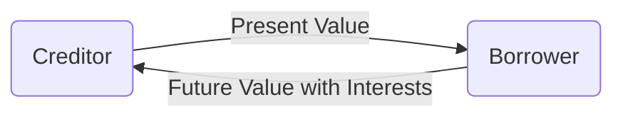
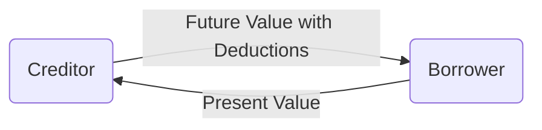

---
tags:
  - "#Business_Mathematics"
  - FMDBUSN
draft: false
aliases:
  - Loan
  - Loans
  - loans
  - loan
---

Here, we define one of the most fundamental types of relationships in businesses: **a simple loan**

# Loan Relationship
Before that, here are the definitions of a Loan Relationship:
- **Interest** – a certain sum of money that the lender charges the borrower for the use of the funds. ^interest-def
- **Lender / Creditor** – the person or institution that makes the funds **available** to those who need it. They **give** funds.^lender-creditor-def
- **Borrower** – the person or institution that **acquire** the funds from the lender. They **acquire** funds.^borrower-def
- **Future Value** - the predicted value acquired in the future, assumed to be greater than present value.
- **Present Value** - the current value of an object

A **loan** is a contract where present value is **exchanged** for a future value between a creditor and borrower, and a difference is **charged** for the cost of moving purchasing power through time. ^loan-def

Illustrated above is [[Simple Interests]].

Illustrated above is [[Simple Discount]]

It is assumed that the borrower will invest time and work to make sure the **future value** is greater than the **present value**. This is the time value of money.^time-value-of-money-def ^24f909

| Direction         | Action       | Action                                           |
| ----------------- | ------------ | ------------------------------------------------ |
| Present -> Future | Accumulation | Interest Rate to grow up the to the future worth |
| Future -> Present | Discounting  | Discount Rate to shrink back to present value    |
