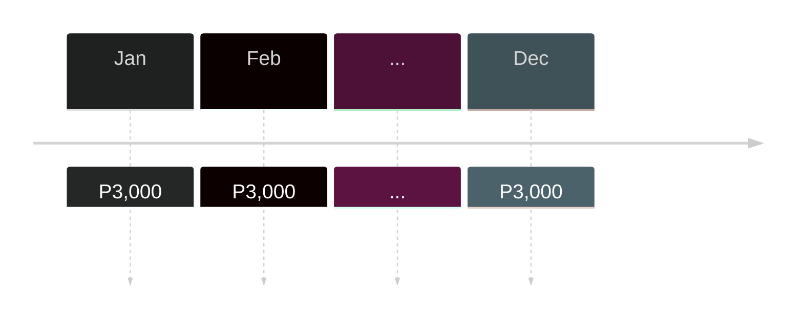

---
tags:
  - Business_Mathematics
  - Finance_and_Business
aliases:
  - annuity
  - annuities
  - ordinary-annuity
---
Annuity are a type of [[Loans and Interests|Loan]] such that the loan is paid in equal amounts of cash or value; timed in equidistant intervals (monthly, quarterly, annually); and, bounded in a limited amount of time.^annuity-def

**Characteristics**:
- Equal Payment
- Equally Timed
- Bounded Contract

## Ordinary Annuity
These are [[Annuity|annuities]] where payment is done at the *end* of each month.^ordinary-annuity-def

## Equation of an Ordinary 

>$$FV_{n}= \text{PMT}\lbrack\frac{(1+i_{ith})^n-1}{i_{th}}\rbrack$$
> Defined Values:
> - $FV$ - [[Future Value]] of annuity at the end of each $n$th period.
> - $PMT$ - Payment deposited at each period.
> - $i$ - interest rate per period
> - $n$ - number of periods for which annuity will last

# Solution Format

Solving annuity requires you to use the [[Timeline Model]] data model