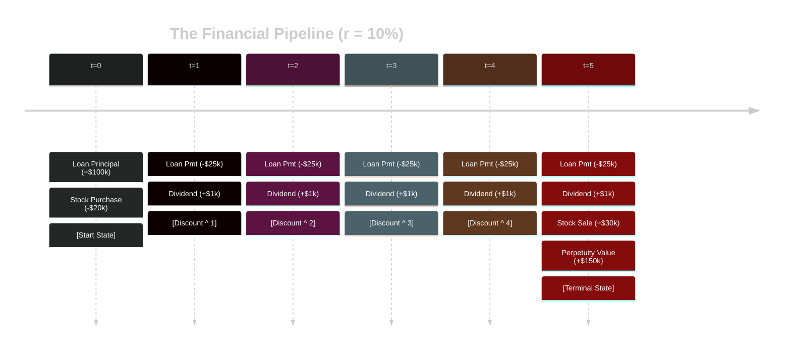

Business often involve a mixed pattern for cash flow, instead of text book examples. To breakdown simply, use a [[Timeline Model]] to summarize the timing and amount of each payment.

# Discounted Cash Flow (DCF) Analysis
A general algorithm (step-by-step instruction) would look like something like this:

## 1. **Anchor** the discount rate
Every project future value is worth less in the present because of the [[Loans and Interests#^time-value-of-money-def|time value of money]], so apply a [[Simple Discount|discount]] for a better representation. 

## 2. **Draw** the boundaries on the timeline
You cannot add "2025 money" to "2030 money", for they are valued differently across time. Assign buckets to each year or time metric appropriate.  

Note, different [[Loans and Interests|loans]] have different ways to be calculated. Here are some major types:
1. [[Annuity|Annuities]] - these have a set number of equal payments. 
2. Stocks - account for the dividends, and account the sale at the end of its maturity date. If not selling, then it is considered a [[Perpetuity]].
3. [[Perpetuity|Perpetuities]] - calculate the sum.

## 3. **Reel and Translate** to the present value
Because of the [[Loans and Interests#^24f909|nature of time and money]], you must [[Simple Discount|discount]] and shrink any future value of projects back to a previous bucket / time slice - all the way back to the present.

We must "penalize" the value of these payments because they haven't happened yet.

## 4. **Final tally** all the components
Once every value is tied back to the present, tally / sum them all up. The sum tells you the present value worth of a business project / venture.

# Case Study: a Vineyard

>[!problem]
> Let us say you want to start 5-year long project of renovating a vineyard and earn a profit. You decided to finance it with the following:
> - **The Loan** (Annuity): You take a $100,000 loan today. To pay it off, you must make $25,000 payments at the end of each year for 5 years.
>- **The Hedge** (Stock): You buy $ 20,000 worth of stock in a tractor company today ($t=0$). It pays a $1,000 dividend at the end of years 1 through 5. You expect to sell the stock for $30,000 at the end of Year 5.
>- **The Legacy** (Perpetuity): Starting at the **end of Year 6**, the high quality wine produced from the vineyard will produce a permanent net cash flow of **\$15,000** per year, forever.

# 1. **Anchor** the discount
Your required return for all parts of this project is **10%** of discount (This is a given). AKA, each future value of investment must be worth **%10**.

# 2. **Draw** Boundaries
You apply slices in years, and accounted each year with the assumptions.

# 3. **Reel and Translate** to Today's Worth 

## 4. **Final tally** all the components