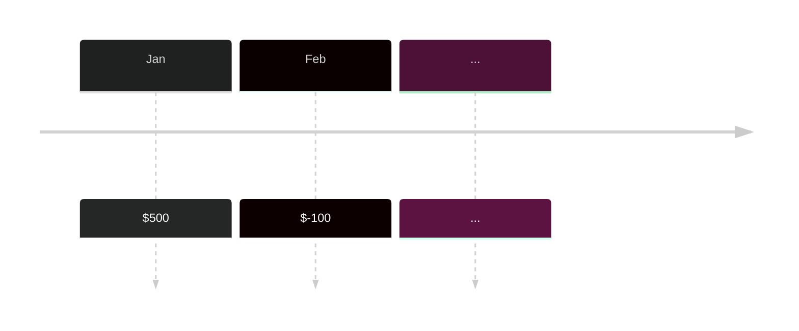

---
tags:
  - Business_Mathematics
  - Finance_and_Business
aliases:
  - timeline
---
A timeline is a model of a stream of payments over time. These streams of payments may include cash received, cash spent, and interests.

Default unit is in years, but it can be any reasonable time unit. By using a timeline, we can predict the **future value** of an investment based on **present value**. We can better model [[Loans and Interests|loans]] this way. 

Timelines especially model investments that are **compounding** - generated earnings from from an investment.^compounding-def

# Rule of 72

Dividing 72 by the interest rate of an loan is an estimate of the number of years it will take to double the value of your investment.^rule-72-def

>[!example]
> A loan generated an annual return of 8%, it will take 9 years (=72/8) to double.