Processes are executed in the order they arrive.

>[!note] Outline
> 1. Order by arrival time
> 2. Calculate Completion Time
> 3. Calculate rest of metrics

# Example
A clear example is given below:

```mermaid
gantt
    title FCFS Scheduling (Arrival: P1=0, P2=1, P3=2, P4=3 | Burst: 4,3,1,2)
    dateFormat X
    axisFormat %s
    
    section Execution
    P1 (BT=4) :0, 4
    P2 (BT=3) :4, 7
    P3 (BT=1) :7, 8
    P4 (BT=2) :8, 10
```

| Process | Arrival Time | Burst Time |
| ------- | ------------ | ---------- |
| P1      | 0            | 4          |
| P2      | 1            | 3          |
| P3      | 2            | 1          |
| P4      | 3            | 2          |
### Solution Steps
1. **Order processes by arrival time**: P1 → P2 → P3 → P4
2. **Calculate Completion Time**:
    - P1: CT = 0 + 4 = 4
    - P2: CT = 4 + 3 = 7
    - P3: CT = 7 + 1 = 8
    - P4: CT = 8 + 2 = 10
3. **Calculate TAT and WT**:

|Process|AT|BT|CT|TAT (CT-AT)|WT (TAT-BT)|
|---|---|---|---|---|---|
|P1|0|4|4|4|0|
|P2|1|3|7|6|3|
|P3|2|1|8|6|5|
|P4|3|2|10|7|5|

**Average WT**: (0 + 3 + 5 + 5) / 4 = **3.25**  
**Average TAT**: (4 + 6 + 6 + 7) / 4 = **5.75**