**Preemptive version of SJF**: The process with the shortest remaining burst time executes. When a new process arrives, if its burst time is less than the remaining time of the current process, the current process is preempted.

### Example Problem

```mermaid
gantt
    title SRTF Scheduling (Preemptive SJF | Burst: 8,4,2,1)
    dateFormat X
    axisFormat %s
    
    section Execution
    P1 (8→7) :0, 1
    P2 (4→3) :1, 2
    P3 (2→0) Done :2, 4
    P4 (1→0) Done :4, 5
    P2 (3→0) Done :5, 8
    P1 (7→0) Done :8, 15
```

|Process|Arrival Time|Burst Time|
|---|---|---|
|P1|0|8|
|P2|1|4|
|P3|2|2|
|P4|3|1|

### Solution Steps

**Decision points** (check at each arrival and completion):

- **Time 0**: P1 arrives (BT=8) → P1 executes
- **Time 1**: P2 arrives (BT=4). P1 remaining=7. P2 < P1 → **Preempt P1**, P2 executes
- **Time 2**: P3 arrives (BT=2). P2 remaining=3. P3 < P2 → **Preempt P2**, P3 executes
- **Time 3**: P4 arrives (BT=1). P3 remaining=1. P4 = P3 → P3 continues
- **Time 4**: P3 completes. P4 remaining=1, P2 remaining=3, P1 remaining=7 → P4 executes
- **Time 5**: P4 completes. P2 remaining=3, P1 remaining=7 → P2 executes
- **Time 8**: P2 completes. P1 executes
- **Time 15**: P1 completes

**Timeline**: P1(0-1) | P2(1-2) | P3(2-4) | P4(4-5) | P2(5-8) | P1(8-15)

|Process|AT|BT|CT|TAT|WT|
|---|---|---|---|---|---|
|P1|0|8|15|15|7|
|P2|1|4|8|7|3|
|P3|2|2|4|2|0|
|P4|3|1|5|2|1|

**Average WT** = (7 + 3 + 0 + 1) / 4 = **2.75**  
**Average TAT** = (15 + 7 + 2 + 2) / 4 = **6.5**
