**Each process gets a small unit of CPU time (time quantum/slice)**, then moves to the back of the ready queue. This is preemptive and designed for time-sharing systems. 

If burst time < quantum, process completes; otherwise, it's preempted.
### Example Problem (Time Quantum = 2)

| Process | Arrival Time | Burst Time |
| ------- | ------------ | ---------- |
| P1      | 0            | 5          |
| P2      | 1            | 3          |
| P3      | 2            | 1          |
| P4      | 3            | 2          |

```mermaid
gantt
    title Round Robin (Quantum=2 | Burst: 5,3,1,2)
    dateFormat X
    axisFormat %s
    
    section Execution
    P1 (5→3) :0, 2
    P2 (3→1) :2, 4
    P3 (1→0) Done :4, 5
    P4 (2→0) Done :5, 7
    P1 (3→1) :7, 9
    P2 (1→0) Done :9, 10
    P1 (1→0) Done :10, 11

```

### Solution Steps

**Timeline execution**:
- 0-2: P1 (remaining: 3)
- 2-4: P2 (remaining: 1)
- 4-5: P3 (completes)
- 5-7: P4 (completes)
- 7-9: P1 (remaining: 1)
- 9-10: P2 (completes)
- 10-11: P1 (completes)

|Process|AT|BT|CT|TAT|WT|
|---|---|---|---|---|---|
|P1|0|5|11|11|6|
|P2|1|3|10|9|6|
|P3|2|1|5|3|2|
|P4|3|2|7|4|2|
