Executes the process with the **shortest burst** time first. When *multiple* processes arrive, choose the one with *shortest* burst time.

# Example 

|Process|Arrival Time|Burst Time|
|---|---|---|
|P1|0|6|
|P2|1|2|
|P3|2|8|
|P4|3|3|

```mermaid
gantt
    title SJF Scheduling (Same arrivals | Burst: 6,2,8,3)
    dateFormat X
    axisFormat %s
    
    section Execution
    P1 (BT=6) :0, 6
    P2 (BT=2) :6, 8
    P4 (BT=3) :8, 11
    P3 (BT=8) :11, 19
```

### Solution Steps

1. **At time 0**: Only P1 available → P1 executes (0-6)
2. **At time 6**: P2, P3, P4 available. Shortest BT is P2 (2) → P2 executes (6-8)
3. **At time 8**: P3, P4 available. Shortest BT is P4 (3) → P4 executes (8-11)
4. **At time 11**: Only P3 left → P3 executes (11-19)

|Process|AT|BT|CT|TAT|WT|
|---|---|---|---|---|---|
|P1|0|6|6|6|0|
|P2|1|2|8|7|5|
|P3|2|8|19|17|9|
|P4|3|3|11|8|5|

**Average WT** = (0 + 5 + 9 + 5) / 4 = **4.75**  
**Average TAT** = (6 + 7 + 17 + 8) / 4 = **9.5**

### Advantages

- Minimum average waiting time among non-preemptive algorithms
- Optimal for batch systems
- Better throughput than FCFS

### Disadvantages

- **Starvation**: Long processes may wait indefinitely
- Requires knowing burst time in advance (often impossible)
- Not suitable for interactive systems
- Favors short processes unfairly

---

